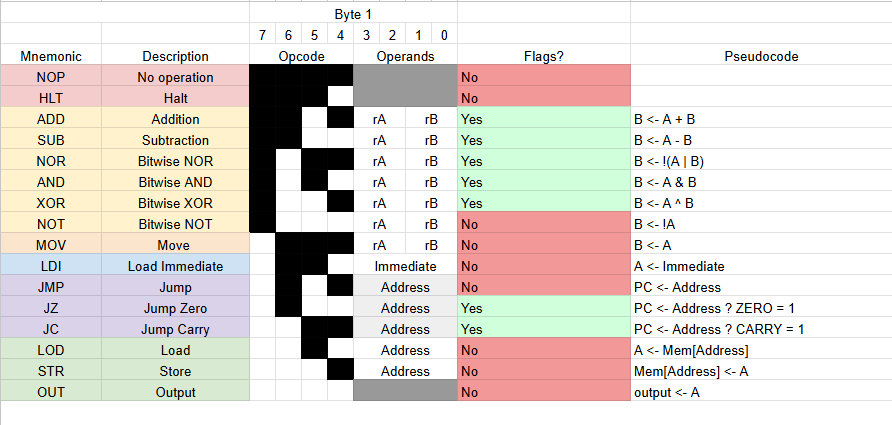

# CPU8B

A 4-Bit CPU with a custom ISA and Assembler
## Instruction Set


## Specs

**Registers**: 2 2-bit operands, 4-bit at registers

**Data memory**: 4-bit address, 8-bits at each address, 16 memory addresses

**Instruction memory**: 4-bit address, 4-bits at each address, 16 memory addresses

**ALU** w/ add, subtract, & bitwise operations. 2 ALU flags, Zero & Carry

**.asm8** file format

### Sample Fibonacci sequence
```asm
; Fibonacci sequence in .asm8
; up to 7 terms of the sequence to printout
; 0, 1, 1, 2, 3, 5, 8, 13

LDI 1       ; rA <- 1, load immediate 1 to reg A
MOV rA rB   ; rB <- rA, move 1 from reg A to B
LDI 0       ; rA <- 0, load immediate 0 to reg A

OUT         ; output first 0

loop:
    MOV rB rC   ; rC <- rB, store temp (old B) value in reg C
    ADD rA rB   ; rB <- rA + rB, add rA to rB
    MOV rC rA   ; rA <- rC,  move old B to reg A

    OUT         ; OUT <- rA, output reg A

    JC end      ; jump carry to end

    JMP loop    ; repeat

end:
    HLT
```

Assembled Machine Code and Mnemonic:

Program Counter - Opcode - rX1 - rX2 - Binary - 8-bit instruction - Hexadecimal - Mnemonic

ex. 
0000 0000 00 00 0b00000000 0x00 NOP


```machinecode
0000  1001 00 01  0b10010001  0x91  LDI
0001  1000 00 01  0b10000001  0x81  MOV
0010  1001 00 00  0b10010000  0x90  LDI
0011  1111 00 00  0b11110000  0xF0  OUT
0100  1000 01 10  0b10000110  0x86  MOV
0101  0010 00 01  0b00100001  0x21  ADD
0110  1000 10 00  0b10001000  0x88  MOV
0111  1111 00 00  0b11110000  0xF0  OUT
1000  1100 10 10  0b11001010  0xCA  JC
1001  1010 01 00  0b10100100  0xA4  JMP
1010  0001 00 00  0b00010000  0x10  HLT
1011  0000 00 00  0b00000000  0x00  NOP
1100  0000 00 00  0b00000000  0x00  NOP
1101  0000 00 00  0b00000000  0x00  NOP
1110  0000 00 00  0b00000000  0x00  NOP
1111  0000 00 00  0b00000000  0x00  NOP
```
*The assembler also can print and save assembled machine code in the above format.*

## Custom Assembler

```asm
; comments start with ;, #, or //

start:
    LDI 5
    MOV rA, rB
    ADD rA, rB
    OUT
    HLT
```

Supports

```asm
NOP
HLT
ADD rA, rB
SUB rA, rB
NOR rA, rB
AND rA, rB
XOR rA, rB
NOT rA, rB
MOV rA, rB

LDI 5
JMP label
JZ label
JC label
LOD 3
STR 3

OUT
OUT rA
```
Register Names

```asm
rA, rB, rC, rD
A, B, C, D
r0, r1, r2, r3
0, 1, 2, 3
```

Number Formats

```asm
5
0b0101
0x5
```

Labels and Definitions

```asm
loop:
    OUT
    JMP loop
    
DEF one 1
FIVE EQU 5
```

